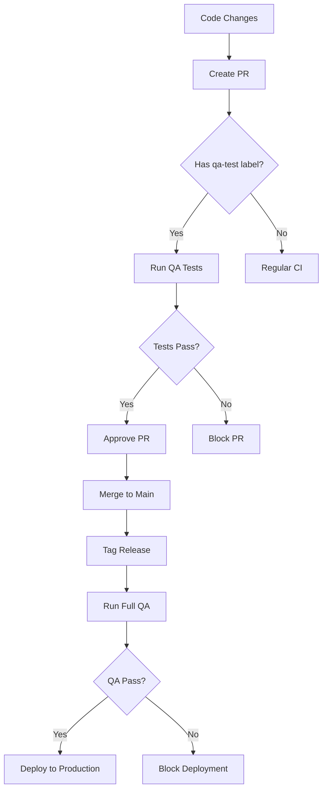

# Pre-Release QA Testing Guide

This guide describes the comprehensive QA testing process for VoxStudent before releases.

## 🎯 Overview

The pre-release QA process ensures that all critical functionality works correctly before deploying to production. It includes:

- **72 comprehensive E2E test cases** across 4 core modules
- **Cross-browser testing** (Chromium, Firefox, WebKit)
- **Automated environment setup** and teardown
- **Detailed reporting** with screenshots and videos
- **Release gate** to prevent faulty deployments

## 🚀 Quick Start

### Local Testing

```bash
# Run complete pre-release QA cycle
npm run pre-release

# Setup QA environment only (for debugging)
npm run pre-release:setup

# Cleanup QA environment
npm run pre-release:cleanup
```

### Manual Commands

```bash
# Setup QA environment
npm run qa:setup

# Run E2E tests
npm run test:e2e:qa

# View logs
npm run qa:logs

# Cleanup
npm run qa:teardown
```

## 📋 Test Coverage

### 1. Login Flow Tests (15 test cases)
- Page layout and structure validation
- Email format validation (valid/invalid)
- Multi-role authentication (admin, teacher, student)
- Unknown email handling
- Loading states and rate limiting
- Responsive design testing
- Keyboard navigation
- Network error handling
- Form state persistence

### 2. Course Management Tests (20 test cases)
- CRUD operations (Create, Read, Update, Delete)
- Form validation and error handling
- Search and filtering
- Pagination testing
- Bulk operations
- Export functionality
- Responsive design
- Concurrent edit handling
- Capacity management

### 3. Student Management Tests (18 test cases)
- Student profile management
- Enrollment processes
- Capacity limits and validation
- Student transfers
- Search and filtering
- Bulk operations
- Delete confirmation and protection
- Responsive design
- Error handling

### 4. Reminder Templates Tests (19 test cases)
- Template creation and validation
- Portuguese variable system ({{nome_do_aluno}}, etc.)
- Template editing and updates
- Variable format validation
- Template previews
- Category filtering
- Usage statistics
- Delete confirmation
- Accessibility testing

## 🔧 Environment Setup

### Prerequisites

- Docker & Docker Compose
- Node.js 18+
- npm
- Git

### QA Environment Architecture

```
┌─────────────────┐    ┌─────────────────┐    ┌─────────────────┐
│   VoxStudent    │    │   PostgreSQL    │    │     Mailpit     │
│   App (QA)      │    │   Database      │    │   Email Test    │
│   Port: 3001    │    │   Port: 5433    │    │   Port: 8025    │
└─────────────────┘    └─────────────────┘    └─────────────────┘
```

### Configuration Files

- **`.env.qa`** - QA environment variables
- **`docker-compose.qa.yml`** - QA services configuration
- **`playwright.config.ts`** - Test configuration

## 📊 Test Execution

### Local Execution

The pre-release script (`scripts/pre-release-qa.sh`) automatically:

1. **Checks prerequisites** (Docker, Node.js, ports)
2. **Cleans up** any existing QA environment
3. **Sets up** fresh QA environment with Docker
4. **Installs** test dependencies and Playwright browsers
5. **Migrates** database and seeds test data
6. **Runs** E2E tests with retry logic
7. **Generates** comprehensive test report
8. **Cleans up** environment

### CI/CD Execution

GitHub Actions workflow (`.github/workflows/pre-release-qa.yml`) runs:

- **Cross-browser testing** on all supported browsers
- **Parallel execution** for faster results
- **Artifact collection** (screenshots, videos, reports)
- **Release gate** to block faulty releases

### Triggering QA Tests

#### Automatic Triggers
- **Git tags**: Any tag matching `v*.*.*` (e.g., `v1.2.3`)
- **Pull requests**: PRs to `main` branch with `qa-test` label
- **Code changes**: Changes to `src/`, `tests/`, config files

#### Manual Triggers
```bash
# Manual workflow dispatch (GitHub Actions)
gh workflow run pre-release-qa.yml -f version=v1.2.3 -f environment=staging

# Local execution
npm run pre-release
```

## 📈 Test Results

### Artifacts Generated

- **HTML Report**: Detailed Playwright test results
- **Screenshots**: Before/after images for each test
- **Videos**: Test execution recordings
- **Logs**: Application and service logs
- **Summary Report**: High-level results and recommendations

### Result Locations

```
test-results/
├── html-report/           # Interactive HTML report
│   └── index.html
├── videos/                # Test execution videos
├── screenshots/           # Test screenshots
└── pre-release-report.md  # Summary report
```

### Viewing Results

```bash
# Open HTML report
npx playwright show-report

# View summary
cat test-results/pre-release-report.md

# Browse screenshots
ls screenshots/
```

## 🔄 CI/CD Integration

### GitHub Actions Features

- **Multi-browser testing** (Chromium, Firefox, WebKit)
- **Parallel execution** for speed
- **Automatic artifact upload**
- **PR comments** with test results
- **Release gating** based on test results

### Release Process Integration



## 🛠️ Troubleshooting

### Common Issues

#### Port Conflicts
```bash
# Check which process is using a port
lsof -i :3001

# Kill process using port
kill -9 $(lsof -t -i:3001)

# Or run cleanup
npm run pre-release:cleanup
```

#### Docker Issues
```bash
# Reset Docker environment
docker-compose -f docker-compose.qa.yml down -v
docker system prune -f

# Rebuild containers
docker-compose -f docker-compose.qa.yml build --no-cache
```

#### Test Failures
```bash
# Run tests in headed mode for debugging
npx playwright test tests/e2e/*.qa.spec.ts --headed --debug

# Run specific test
npx playwright test tests/e2e/login-flow.qa.spec.ts

# View application logs
npm run qa:logs
```

#### Database Issues
```bash
# Reset QA database
npm run db:reset:qa

# Rerun migrations
npm run db:migrate:qa

# Reseed data
npm run db:seed:qa
```

### Debug Mode

```bash
# Setup environment and stop (for debugging)
npm run pre-release:setup

# Access services for debugging
curl http://localhost:3001/api/health
docker exec -it voxstudent-postgres-qa psql -U voxstudent -d voxstudent_qa

# Cleanup when done
npm run pre-release:cleanup
```

### Performance Tuning

#### Speed up tests
```bash
# Run tests in parallel
npx playwright test --workers=4

# Skip slow tests
npx playwright test --grep-invert "slow"

# Use specific browser
npx playwright test --project=chromium
```

#### Reduce resource usage
```bash
# Limit Docker memory
docker-compose -f docker-compose.qa.yml up --scale app-qa=1

# Use headless mode
export PLAYWRIGHT_HEADLESS=true
```

## 📝 Writing New Tests

### Test Structure
```typescript
test.describe('Feature Name E2E Tests', () => {
  // Setup and teardown
  test.beforeAll(async ({ browser }) => { /* ... */ });
  test.afterAll(async () => { /* ... */ });
  
  // Test cases
  test('01 - Should perform basic functionality', async () => {
    // Test implementation
  });
});
```

### Best Practices

1. **Use descriptive test names**: `01 - Should create new reminder template`
2. **Take screenshots**: Before and after each test
3. **Clean up test data**: Delete created items in teardown
4. **Handle async operations**: Use `waitForLoadState('networkidle')`
5. **Make tests independent**: Each test should work in isolation
6. **Use proper selectors**: Prefer data attributes over CSS classes
7. **Test error scenarios**: Network failures, validation errors
8. **Verify accessibility**: Keyboard navigation, ARIA labels

### Adding New Test Suites

1. Create test file: `tests/e2e/new-feature.qa.spec.ts`
2. Follow existing patterns from other test files
3. Update this documentation
4. Add to CI/CD pipeline if needed

## 🔐 Security Considerations

- **Isolated environment**: QA runs in complete isolation
- **Test credentials**: Only use designated test accounts
- **No production data**: Never use real user data
- **Cleanup**: All test data is automatically cleaned up
- **Network isolation**: QA services don't access external systems

## 📞 Support

For issues with the QA process:

1. **Check logs**: `npm run qa:logs`
2. **Review test results**: `test-results/html-report/index.html`
3. **Run cleanup**: `npm run pre-release:cleanup`
4. **Report issues**: Create GitHub issue with logs and screenshots

## 🔄 Maintenance

### Regular Tasks

- **Update test data**: Keep test users and courses current
- **Review test coverage**: Ensure new features have tests
- **Update dependencies**: Keep Playwright and browsers updated
- **Monitor performance**: Optimize slow tests
- **Review reports**: Analyze test failure patterns

### Monthly Review

- Analyze test execution metrics
- Update test scenarios based on user feedback
- Review and update test data
- Optimize test execution time
- Update documentation